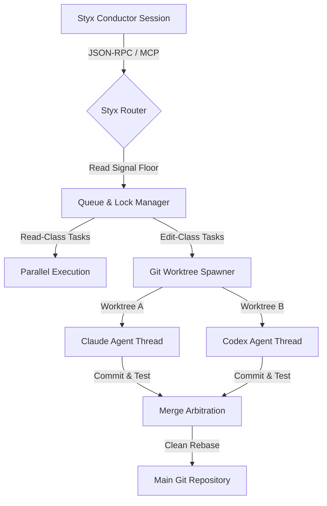

# Styx 2026 Technical Expansion Brief: Multi-Agent Orchestration, Bleeding-Edge MCP, Subscription Optimization, and Safe Parallelism

## Executive Summary

Styx is an open-source Go CLI designed to orchestrate software development tasks across multiple AI agent channels (`claude`, `codex`, `agy` [Google Antigravity], and local `ollama`). Its baseline architecture features a hand-curated rules table (`routing.toml`), a local SQLite budget ledger with WAL for session/weekly caps, a codebase indexer, resumable multi-stage pipelines, and a learning loop (`styx learn`) fueled by telemetry outcomes and session retrospectives.

This brief investigates the strategic and technical pathways for expanding Styx in mid-2026. It focuses on four major areas:
1. **Emerging patterns in multi-agent orchestration and CLI coordination**, emphasizing cross-agent signaling, concurrency models, and git worktree isolation.
2. **Standard and bleeding-edge MCP specifications**, specifically sampling, task management, progress notifications, and elicitation primitives.
3. **Usage and cost optimization techniques** across user-defined subscription configurations (e.g. Claude Pro/Max, ChatGPT Plus, Gemini/Antigravity) using SQLite sliding-window ledger math and prompt cache alignment.
4. **Genuinely novel feature categories**, including a cost-aware capability routing heuristic, critic-arbitration loops, and eval-driven scoring.

---

## 1. Multi-Agent & Multi-CLI Coordination Patterns

The agentic developer-tooling landscape in mid-2026 has moved away from monolithic LLM loops to modular, parallel, and specialized networks of agents. Emerging developer tools (such as Claude Code, OpenHands, and Aider) have introduced patterns that Styx can adapt for robust multi-agent orchestration.



### Cross-Agent Coordination & Communication
*   **Hierarchical Conductor-Worker**: Conductor sessions act as the central dispatcher, delegating complex sub-problems to specialized worker processes.
*   **Blackboard Pattern**: Agents do not talk directly to each other; instead, they read and write to a shared project-level workspace state (e.g. `state.json` or `.claude/context.md`).
*   **Event Streams**: In agent adapters, agents emit structured JSON event lines (e.g., `item.completed`, `tool.call`, `run.failed`). Orchestrators parse these streams reactively, adjusting plans without waiting for subprocess exit.

### Concurrency & Parallelism
In early versions of multi-agent CLI runners, concurrent execution led to immediate file-system races and compilation locks (e.g., `go.sum` lockups, Cargo build-lock errors, database migrations colliding). 
*   **Read-Class Concurrency**: Safe to run in parallel directly in the main workspace.
*   **Edit-Class Serialization**: While Styx's current concurrency model relies on a background task registry, a per-project write queue to serialize writes, and a pipeline lock, the proposed expansion design introduces Git Worktree-based safe parallelism.
*   **Worktree Isolation**: A promising design path for parallel edits. Instead of locking the project, the orchestrator spawns ephemeral Git Worktrees.

### Git Worktree-Based Safe Parallelism
By spawning a new worktree, each agent runs in its own isolated physical directory that shares the underlying `.git` repository storage but has separate files, branch checkouts, and build artifacts.

#### Worktree Path Compatibility & Location Trade-offs
A critical architectural choice is where to place ephemeral worktrees.
1.  **System-Level Temp Directory (`os.TempDir()`)**: Spawning worktrees in system temp paths keeps the main project tree completely clean. However, it frequently breaks local build tools, compiler caches, relative configurations (e.g., searching parent directories for configuration files), and dependency caches (e.g., `node_modules` or `.env` configs).
2.  **Project-Local Directory (`<project-root>/.styx/worktrees/`)**: Placing worktrees within a dedicated subdirectory under the project root resolves these build compatibility issues by preserving parent path relationships and cache access. However, this is a mixed trade-off: tools running in `.styx/worktrees/<branch>` may walk up to the main repository's `node_modules`, `.env`, or other caches. While this improves compatibility, it can also contaminate supposedly isolated builds when dependencies or environment files differ between the task branch and the main checkout. To avoid making the tracked `.gitignore` file dirty (which would abort the subsequent merge check), the worktree subdirectory is kept hidden from git checks by appending it to the local, untracked exclude file under the resolved git common directory (e.g., `<git-common-dir>/info/exclude`). To prevent concurrency races where two Styx processes simultaneously modify this file, the manager acquires an exclusive advisory file lock before reading or writing to the exclude file.

To support both modes, the Git Worktree Manager defaults to project-local paths for compatibility, while retaining a configurable fallback to system temp paths when a zero-footprint run is requested.

#### Handling Edge Cases and Safety Guards
To maintain a safe workspace, the proposed Worktree Manager design resolves several key engineering hurdles:
1.  **Branch-Name Collisions**: Generating a static branch name like `styx-task-t1` will conflict if a previous task failed or timed out. Because task IDs may contain characters that are illegal in git ref names (such as spaces, slashes in wrong positions, `..`, `~`, `^`, `:`, `?`, `*`, `[`, backslashes, or `.lock`), the manager sanitizes `taskID` into a validated ref-name slug before embedding it. It then combines this slug with a timestamp and a short random suffix to form the branch name. To prevent exceeding filesystem path or Git ref path constraints (e.g., 255 characters), the sanitized slug is truncated to a safe length (e.g., 60 characters). If a collision occurs, the worktree spawner retries the creation up to 10 times, generating a new suffix each time. Additionally, the failed-branch cleanup rename flow executes up to 10 validation checks to confirm branch name uniqueness, returning an explicit error if a collision cannot be resolved, rather than blindly attempting `git branch -m`.
2.  **Workspace Branch Restoration**: The merge flow could check out the target branch in the main worktree. If the user launched Styx from another branch, this would leave their main repository on a different active branch as an unwanted side effect. To prevent this, the proposed Worktree Manager records the original checked-out HEAD (active branch or detached commit) in the main worktree and restores it in a deferred cleanup block on exit.
3.  **Dirty Main Worktrees**: If the user has unstaged modifications in their active worktree, merging branches could clobber their work. Rather than trying to auto-stash and risk popping conflicts or popping the wrong stash under concurrent operations, the safest approach is to run a pre-check via `git status --porcelain` on the main tree and abort the operation immediately if the workspace is dirty, protecting user modifications.
4.  **Submodules**: Ephemeral worktrees do not automatically initialize submodules. The proposed manager runs `git submodule update --init --recursive` within the worktree path if a `.gitmodules` file is detected.
5.  **Git LFS (Large File Storage)**: Git LFS pointers must be fully populated inside the worktree directory. If the repository uses Git LFS (which can be configured via root or nested `.gitattributes` files, global attributes, or `$GIT_DIR/info/attributes`), the proposed manager verifies that `git-lfs` is installed and configured properly using `git lfs status`, and runs `git lfs pull` to ensure large binary assets are present for builds and tests, failing explicitly if Git LFS is required but misconfigured. To detect LFS usage robustly, the manager queries `git lfs ls-files`, walks the directory to check local `.gitattributes` files, reads the git common directory's `info/attributes` file, and checks global configuration paths.
6.  **Failed Merges**: If rebasing the task branch onto the target branch fails, the manager aborts the rebase (`git rebase --abort`) to leave the repository unaltered and clean.
7.  **Cleanup after Partial Failure**: If compilation or test suites fail, or if an agent execution times out, the proposed manager removes the worktree (`git worktree remove --force`) and renames the branch to start with the `styx/failed/` prefix. To prevent leaving the workspace in an inconsistent state, if the forced worktree removal fails, the branch operation is aborted to avoid a mismatch; if the worktree is removed but the branch cannot be renamed/deleted (e.g. checked out elsewhere), a descriptive compound error is returned rather than silently claiming success.
8.  **Remote Refs, Stale Local Branches & Merge Synchronization**: Rebasing against target branches locally does not account for changes on remote branches, which can lead to stale local refs. Additionally, concurrent tasks could simultaneously attempt to merge back into the main repository, resulting in checkout collisions and race conditions. The proposed rebase-merge flow resolves these issues:
    *   **Unambiguous Fetch and Rebase**: The flow separates the concept of `baseRef` (the rebase base, e.g., `origin/main` or a local tracking branch) from `localBranch` (the local branch to checkout and update, e.g., `main`). If `baseRef` represents a remote branch (e.g. starting with `origin/`), it fetches the remote updates via `git fetch origin <remoteBranch>` and rebases the ephemeral task branch against `FETCH_HEAD` rather than the potentially stale local tracking branch.
    *   **Cross-Process Merge Lock**: All operations that check git status, checkout the main branch, and apply fast-forward merges are serialized using an advisory lock file (`styx-merge.lock`) resolved and acquired inside the actual git common directory (accounting for submodules and linked worktrees) via Go's syscall lock primitives. This lock is strictly an advisory lock file to coordinate concurrent Styx processes; it cannot prevent external processes (like the user, IDE, hooks, or non-Styx Git commands) from modifying, dirtying, or switching the main worktree between checks. To mitigate this, Styx performs a final status check after acquiring the lock to ensure safety.

#### Go Code Pattern: Git Worktree Manager
Below is a buildable implementation pattern for managing worktree isolation in Styx, designed to interface with the existing [manager.go](../../../internal/agent/manager.go) architecture while addressing workspace safety rules.

```go
package agent

import (
	"context"
	"crypto/rand"
	"encoding/hex"
	"fmt"
	"io"
	"os"
	"os/exec"
	"path/filepath"
	"strings"
	"syscall"
	"time"
)

// Worktree represents an ephemeral workspace for an agent task.
type Worktree struct {
	Path       string
	Branch     string
	BaseCommit string
	ProjectDir string
}

// randSuffix generates a short cryptographically random string to prevent branch collisions.
// If crypto/rand fails, it falls back to a timestamp-based hex representation to avoid a fixed-string collision.
func randSuffix() string {
	b := make([]byte, 4)
	if _, err := rand.Read(b); err != nil {
		return fmt.Sprintf("%x", time.Now().UnixNano()&0xffff)
	}
	return hex.EncodeToString(b)
}

// sanitizeRefSlug sanitizes a string to make it safe for use in git branch/ref names.
// It replaces invalid characters with hyphens, collapses consecutive hyphens, and truncates
// the result to a maximum length (e.g., 60 characters) to avoid exceeding ref path limits.
func sanitizeRefSlug(s string) string {
	var sb strings.Builder
	for _, r := range s {
		// Keep alphanumeric, underscore, or hyphen
		if (r >= 'a' && r <= 'z') || (r >= 'A' && r <= 'Z') || (r >= '0' && r <= '9') || r == '_' || r == '-' {
			sb.WriteRune(r)
		} else {
			sb.WriteRune('-')
		}
	}
	res := sb.String()
	// Collapse consecutive hyphens
	for strings.Contains(res, "--") {
		res = strings.ReplaceAll(res, "--", "-")
	}
	// Trim leading/trailing hyphens/dots
	res = strings.Trim(res, "-.")
	
	// Truncate to a safe length (e.g. 60 chars) to prevent filesystem/git ref path limit violations
	if len(res) > 60 {
		res = res[:60]
		res = strings.TrimSuffix(res, "-")
	}
	
	if res == "" {
		res = "task"
	}
	return res
}

// NewWorktree creates and registers an ephemeral git worktree, retrying on branch collisions.
// It supports placing the worktree either under a project-local directory (.styx/worktrees/)
// for build/tooling compatibility, or a system temp directory if useTempDir is true.
func NewWorktree(ctx context.Context, projectDir, taskID string, baseCommit string, useTempDir bool) (*Worktree, error) {
	var wt *Worktree
	var err error
	var branch string
	var wtDir string

	// 1. Resolve worktree root directory.
	// We prefer project-local worktrees to keep compilers and builders compatible with relative paths.
	var worktreeRoot string
	if useTempDir {
		worktreeRoot = filepath.Join(os.TempDir(), "styx-worktrees")
	} else {
		worktreeRoot = filepath.Join(projectDir, ".styx", "worktrees")
		
		// Ensure the local worktree path is registered in the exclude file (located in the git common directory)
		if err := ensureGitExcluded(ctx, projectDir, ".styx/worktrees/"); err != nil {
			return nil, fmt.Errorf("failed to update git exclude: %w", err)
		}
	}

	// Retry loop to safely handle name collisions
	for i := 0; i < 10; i++ {
		suffix := randSuffix()
		timestamp := time.Now().Unix()
		safeTaskID := sanitizeRefSlug(taskID)
		branch = fmt.Sprintf("styx-task-%s-%d-%s", safeTaskID, timestamp, suffix)
		wtDir = filepath.Join(worktreeRoot, branch)

		if err = os.MkdirAll(filepath.Dir(wtDir), 0755); err != nil {
			return nil, fmt.Errorf("create worktree container: %w", err)
		}

		// git worktree add -b <branch> <path> <baseCommit>
		cmd := exec.CommandContext(ctx, "git", "worktree", "add", "-b", branch, wtDir, baseCommit)
		cmd.Dir = projectDir
		if out, cmdErr := cmd.CombinedOutput(); cmdErr != nil {
			outStr := string(out)
			// Check if the failure is due to a naming/branch collision or a fatal error
			isCollision := strings.Contains(outStr, "already exists") ||
				strings.Contains(outStr, "already checked out") ||
				strings.Contains(outStr, "already registered")
			if isCollision {
				err = fmt.Errorf("git worktree add collision: %s: %w", outStr, cmdErr)
				continue // Retry with a new name
			}
			return nil, fmt.Errorf("fatal git worktree add error: %s: %w", outStr, cmdErr)
		}

		wt = &Worktree{
			Path:       wtDir,
			Branch:     branch,
			BaseCommit: baseCommit,
			ProjectDir: projectDir,
		}
		err = nil
		break
	}

	if err != nil {
		return nil, fmt.Errorf("failed to create unique worktree branch after 10 attempts: %w", err)
	}

	// Handle submodules if present
	if _, err := os.Stat(filepath.Join(projectDir, ".gitmodules")); err == nil {
		subCmd := exec.CommandContext(ctx, "git", "submodule", "update", "--init", "--recursive")
		subCmd.Dir = wt.Path
		if out, err := subCmd.CombinedOutput(); err != nil {
			_ = wt.Cleanup(ctx, false) // clean up directory on failure
			return nil, fmt.Errorf("git submodule update failed: %s: %w", string(out), err)
		}
	}

	// Handle Git LFS if the project uses it
	if usesLFS(ctx, projectDir) {
		lfsCheck := exec.CommandContext(ctx, "git", "lfs", "status")
		lfsCheck.Dir = wt.Path
		if err := lfsCheck.Run(); err != nil {
			_ = wt.Cleanup(ctx, false)
			return nil, fmt.Errorf("git lfs is required by this repository, but git lfs status failed (check if git-lfs is installed/configured): %w", err)
		}
		lfsPull := exec.CommandContext(ctx, "git", "lfs", "pull")
		lfsPull.Dir = wt.Path
		if out, err := lfsPull.CombinedOutput(); err != nil {
			_ = wt.Cleanup(ctx, false)
			return nil, fmt.Errorf("git lfs pull failed: %s: %w", string(out), err)
		}
	}

	return wt, nil
}

// usesLFS checks if the repository uses Git LFS by walking the project directory
// to scan all .gitattributes files, reading the git common directory's info/attributes,
// checking any global attributes file configured in git, or running 'git lfs ls-files'.
func usesLFS(ctx context.Context, projectDir string) bool {
	// First, a fast check using 'git lfs ls-files' (if git-lfs is installed)
	cmd := exec.CommandContext(ctx, "git", "lfs", "ls-files")
	cmd.Dir = projectDir
	if out, err := cmd.Output(); err == nil && len(strings.TrimSpace(string(out))) > 0 {
		return true
	}

	// Helper to check if a file contains LFS filter patterns
	checkLFSAttrFile := func(path string) bool {
		data, err := os.ReadFile(path)
		return err == nil && strings.Contains(string(data), "filter=lfs")
	}

	// 1. Walk the project directory and check all local .gitattributes files (root and nested)
	var found bool
	errStop := fmt.Errorf("stop")
	_ = filepath.Walk(projectDir, func(path string, info os.FileInfo, err error) error {
		if err != nil {
			return nil
		}
		if info.IsDir() {
			name := info.Name()
			if name == ".git" || name == ".styx" {
				return filepath.SkipDir
			}
			return nil
		}
		if info.Name() == ".gitattributes" {
			if checkLFSAttrFile(path) {
				found = true
				return errStop
			}
		}
		return nil
	})
	if found {
		return true
	}

	// 2. Check local git directory info/attributes ($GIT_DIR/info/attributes)
	if gitDir, err := resolveGitCommonDir(ctx, projectDir); err == nil {
		infoAttrs := filepath.Join(gitDir, "info", "attributes")
		if checkLFSAttrFile(infoAttrs) {
			return true
		}
	}

	// 3. Check global attributes file if defined in git config
	configCmd := exec.CommandContext(ctx, "git", "config", "--get", "core.attributesfile")
	configCmd.Dir = projectDir
	if globalAttrsPathRaw, err := configCmd.Output(); err == nil {
		globalAttrsPath := strings.TrimSpace(string(globalAttrsPathRaw))
		// Handle home directory tilde if present
		if strings.HasPrefix(globalAttrsPath, "~/") {
			if home, err := os.UserHomeDir(); err == nil {
				globalAttrsPath = filepath.Join(home, globalAttrsPath[2:])
			}
		}
		if globalAttrsPath != "" && checkLFSAttrFile(globalAttrsPath) {
			return true
		}
	}

	// Also check fallback standard global locations
	if home, err := os.UserHomeDir(); err == nil {
		fallbacks := []string{
			filepath.Join(home, ".config", "git", "attributes"),
			filepath.Join(home, ".gitattributes"),
		}
		for _, f := range fallbacks {
			if checkLFSAttrFile(f) {
				return true
			}
		}
	}

	return false
}

// ensureGitExcluded appends the pattern to the exclude file under the resolved git common directory.
// It uses an advisory file lock to prevent concurrent write races.
func ensureGitExcluded(ctx context.Context, projectDir, pattern string) error {
	gitDir, err := resolveGitCommonDir(ctx, projectDir)
	if err != nil {
		return err
	}
	excludeDir := filepath.Join(gitDir, "info")
	if err := os.MkdirAll(excludeDir, 0755); err != nil {
		return err
	}
	
	excludePath := filepath.Join(excludeDir, "exclude")
	f, err := os.OpenFile(excludePath, os.O_RDWR|os.O_CREATE, 0644)
	if err != nil {
		return err
	}
	defer f.Close()

	// Apply an exclusive advisory lock to prevent races between concurrent processes
	if err := syscall.Flock(int(f.Fd()), syscall.LOCK_EX); err != nil {
		return fmt.Errorf("lock exclude file: %w", err)
	}
	defer func() {
		_ = syscall.Flock(int(f.Fd()), syscall.LOCK_UN)
	}()

	content, err := io.ReadAll(f)
	if err != nil {
		return err
	}

	if strings.Contains(string(content), pattern) {
		return nil
	}

	newContent := string(content)
	if len(newContent) > 0 && !strings.HasSuffix(newContent, "\n") {
		newContent += "\n"
	}
	newContent += pattern + "\n"

	if _, err := f.Seek(0, 0); err != nil {
		return err
	}
	if err := f.Truncate(0); err != nil {
		return err
	}
	_, err = f.WriteString(newContent)
	return err
}

// Cleanup tears down the worktree. If mergedSuccessfully is true, it also deletes the ephemeral branch.
func (w *Worktree) Cleanup(ctx context.Context, mergedSuccessfully bool) error {
	// 1. Attempt to remove the worktree. If this fails, we cannot proceed with branch deletion or renaming
	// since git keeps the branch locked to the active worktree.
	cmd := exec.CommandContext(ctx, "git", "worktree", "remove", "--force", w.Path)
	cmd.Dir = w.ProjectDir
	if out, err := cmd.CombinedOutput(); err != nil {
		return fmt.Errorf("remove worktree directory %s failed (branch %s remains locked): %s: %w", w.Path, w.Branch, string(out), err)
	}

	// 2. Perform branch operations (delete or rename)
	if mergedSuccessfully {
		cmd = exec.CommandContext(ctx, "git", "branch", "-D", w.Branch)
		cmd.Dir = w.ProjectDir
		if out, err := cmd.CombinedOutput(); err != nil {
			return fmt.Errorf("worktree removed successfully, but failed to delete branch %s (check if checked out elsewhere): %s: %w", w.Branch, string(out), err)
		}
	} else {
		failedBranch := "styx/failed/" + w.Branch
		foundUnique := false
		for i := 0; i < 10; i++ {
			checkCmd := exec.CommandContext(ctx, "git", "show-ref", "--verify", "refs/heads/"+failedBranch)
			checkCmd.Dir = w.ProjectDir
			if err := checkCmd.Run(); err != nil {
				foundUnique = true
				break
			}
			failedBranch = fmt.Sprintf("styx/failed/%s-%s", w.Branch, randSuffix())
		}
		if !foundUnique {
			return fmt.Errorf("worktree removed successfully, but failed to find a unique branch name under styx/failed/ after 10 attempts")
		}

		cmd = exec.CommandContext(ctx, "git", "branch", "-m", w.Branch, failedBranch)
		cmd.Dir = w.ProjectDir
		if out, err := cmd.CombinedOutput(); err != nil {
			return fmt.Errorf("worktree removed successfully, but failed to rename branch %s to %s (check if checked out elsewhere): %s: %w", w.Branch, failedBranch, string(out), err)
		}
	}

	return nil
}

// resolveGitCommonDir executes 'git rev-parse --git-common-dir' to find the actual shared git directory.
func resolveGitCommonDir(ctx context.Context, projectDir string) (string, error) {
	cmd := exec.CommandContext(ctx, "git", "rev-parse", "--git-common-dir")
	cmd.Dir = projectDir
	out, err := cmd.Output()
	if err != nil {
		return filepath.Join(projectDir, ".git"), nil
	}
	path := strings.TrimSpace(string(out))
	if !filepath.IsAbs(path) {
		path = filepath.Clean(filepath.Join(projectDir, path))
	}
	return path, nil
}

// acquireMergeLock acquires a cross-process advisory lock on the main repository
// by resolving the actual git common directory (handling worktrees and submodules).
func acquireMergeLock(ctx context.Context, projectDir string) (*os.File, error) {
	gitDir, err := resolveGitCommonDir(ctx, projectDir)
	if err != nil {
		return nil, err
	}
	lockPath := filepath.Join(gitDir, "styx-merge.lock")
	if err := os.MkdirAll(filepath.Dir(lockPath), 0755); err != nil {
		return nil, err
	}
	f, err := os.OpenFile(lockPath, os.O_CREATE|os.O_RDWR, 0666)
	if err != nil {
		return nil, err
	}
	// Apply an exclusive, blocking advisory lock
	if err := syscall.Flock(int(f.Fd()), syscall.LOCK_EX); err != nil {
		f.Close()
		return nil, err
	}
	return f, nil
}

// releaseMergeLock releases the advisory lock on the lock file.
func releaseMergeLock(f *os.File) error {
	if f == nil {
		return nil
	}
	defer f.Close()
	return syscall.Flock(int(f.Fd()), syscall.LOCK_UN)
}

// MergeAndRebase performs a clean rebase of the worktree branch onto the baseRef (e.g. origin/main or dev),
// then checkouts localBranch and merges w.Branch fast-forward into it. It acquires a cross-process merge lock
// to prevent checkout/merge races on the main worktree, and records the original active HEAD to restore it afterward.
func (w *Worktree) MergeAndRebase(ctx context.Context, baseRef, localBranch string) error {
	// Acquire cross-process merge lock to prevent concurrent checkout/merge races on the main worktree.
	// Note: This only coordinates concurrent Styx processes; it cannot prevent users or other external Git processes from modifying the tree.
	lockFile, err := acquireMergeLock(ctx, w.ProjectDir)
	if err != nil {
		return fmt.Errorf("acquire merge lock: %w", err)
	}
	defer func() {
		_ = releaseMergeLock(lockFile)
	}()

	statusCmd := exec.CommandContext(ctx, "git", "status", "--porcelain")
	statusCmd.Dir = w.ProjectDir
	statusOut, err := statusCmd.Output()
	if err != nil {
		return fmt.Errorf("check git status: %w", err)
	}

	isDirty := len(strings.TrimSpace(string(statusOut))) > 0
	if isDirty {
		return fmt.Errorf("main workspace is dirty (has uncommitted changes); aborting merge to prevent clobbering user work")
	}

	origCmd := exec.CommandContext(ctx, "git", "symbolic-ref", "--short", "-q", "HEAD")
	origCmd.Dir = w.ProjectDir
	origOut, origErr := origCmd.Output()
	var originalRef string
	var isDetached bool
	if origErr != nil {
		revCmd := exec.CommandContext(ctx, "git", "rev-parse", "HEAD")
		revCmd.Dir = w.ProjectDir
		revOut, err := revCmd.Output()
		if err != nil {
			return fmt.Errorf("failed to determine original HEAD: %w", err)
		}
		originalRef = strings.TrimSpace(string(revOut))
		isDetached = true
	} else {
		originalRef = strings.TrimSpace(string(origOut))
	}

	defer func() {
		var checkoutArgs []string
		if isDetached {
			checkoutArgs = []string{"checkout", "--detach", originalRef}
		} else {
			checkoutArgs = []string{"checkout", originalRef}
		}
		restoreCmd := exec.CommandContext(ctx, "git", checkoutArgs...)
		restoreCmd.Dir = w.ProjectDir
		_ = restoreCmd.Run()
	}()

	rebaseTarget := baseRef
	if strings.HasPrefix(baseRef, "origin/") {
		remoteBranch := strings.TrimPrefix(baseRef, "origin/")
		// Fetching origin <remoteBranch> updates FETCH_HEAD with the latest remote commit.
		// Rebasing against FETCH_HEAD avoids the ambiguity of stale origin/ remote-tracking refs.
		fetchCmd := exec.CommandContext(ctx, "git", "fetch", "origin", remoteBranch)
		fetchCmd.Dir = w.ProjectDir
		if out, err := fetchCmd.CombinedOutput(); err != nil {
			return fmt.Errorf("git fetch origin %s failed: %s: %w", remoteBranch, string(out), err)
		}
		rebaseTarget = "FETCH_HEAD"
	}

	// 1. Rebase the worktree branch onto the rebaseTarget (e.g. FETCH_HEAD or local branch)
	rebaseCmd := exec.CommandContext(ctx, "git", "rebase", rebaseTarget)
	rebaseCmd.Dir = w.Path
	if out, err := rebaseCmd.CombinedOutput(); err != nil {
		abortCmd := exec.CommandContext(ctx, "git", "rebase", "--abort")
		abortCmd.Dir = w.Path
		_ = abortCmd.Run()
		return fmt.Errorf("rebase branch %s onto %s failed (aborted): %s: %w", w.Branch, baseRef, string(out), err)
	}

	// 2. Switch main workspace to the local branch to be updated
	cmd := exec.CommandContext(ctx, "git", "checkout", localBranch)
	cmd.Dir = w.ProjectDir
	if out, err := cmd.CombinedOutput(); err != nil {
		return fmt.Errorf("checkout local branch %s: %s: %w", localBranch, string(out), err)
	}

	// 3. Fast-forward merge the rebased worktree branch back into localBranch
	cmd = exec.CommandContext(ctx, "git", "merge", w.Branch, "--ff-only")
	cmd.Dir = w.ProjectDir
	if out, err := cmd.CombinedOutput(); err != nil {
		return fmt.Errorf("merge branch %s into %s failed: %s: %w", w.Branch, localBranch, string(out), err)
	}

	return nil
}
```

---

## 2. MCP Ecosystem Direction: Standard vs. Bleeding Edge

The Model Context Protocol (MCP) is an open-source, standard protocol designed to bridge AI client applications (e.g. Cursor, VS Code, Claude Code) and tool-serving servers. For Styx, leveraging MCP goes beyond exposing local tools; it involves adopting standard client-server specifications.

| Feature Primitive | Styx Custom Status (Current/Piggyback) | Standard MCP Protocol Specification (2025-11-25) |
| :--- | :--- | :--- |
| **Async Task Bookkeeping** | Piggyback status line (`"bg"` string field in custom JSON-RPC returns) + manual polling via `collect`. | Experimental Task APIs (`tasks/get`, `tasks/result`, `tasks/list`, `tasks/cancel`) and `notifications/tasks/status` status notifications. |
| **Progress Reporting** | Basic server progress emission exists via `notifications/progress` when `_meta.progressToken` is provided. However, running subprocesses/tools do not consistently stream updates or propagate tokens. | Standardized `notifications/progress` notifications natively mapping to IDE loaders. |
| **Model Hookups** | Shell execs to CLIs utilizing user subscriptions. | **MCP Sampling Protocol** (`sampling/createMessage`) requesting the host client to compute completions. |
| **Elicitation / Inputs** | Blocks tool execution or halts if input/approvals are required. | **Elicitation Primitives** (UI forms and confirmations; explicitly forbids requesting sensitive information/credentials). |

### Standardized Async Task Management (2025-11-25 Spec)
Background task tracking under the Model Context Protocol (2025-11-25) is defined as an **experimental** capability extension rather than a stable standard primitive. Task capability support must be explicitly negotiated during initialization and remains entirely optional for host clients. Therefore, the roadmap does not treat the Task API as a guaranteed replacement for `bg`/`collect` across all hosts. Styx must maintain a fallback to synchronous execution or its custom `bg`/`collect` mechanics if the host does not advertise or support the task capability.

Unlike fully automatic background migration, the protocol enforces strict integration constraints:
*   **Capability Negotiation**: Client-side support for background tasks is capability-negotiated during the initialization handshake.
*   **Request-Level Augmentation**: Task augmentation is not automatic for all tool calls. It must be initiated on a per-request basis by the client adding a `task` field (specifying client-side task tracking options) to the original request parameters (e.g., inside the `tools/call` parameters). If the client does not supply the `task` field in the request params, the server must either execute the request synchronously OR, if the tool has advertised `execution.taskSupport: "required"` in its definition, the server must reject the call immediately rather than run it synchronously. This changes the migration contract for replacing `bg`/`collect`.

When task execution is supported and requested by the client:
1. **Task Deferral (`CreateTaskResult`)**: Long-running tool executions or operations return a `CreateTaskResult` containing a unique task ID, signalling to the client that the request has been deferred.
2. **Two-Phase Lifecycle Retrieval (`tasks/get` & `tasks/result`)**:
   * **Polling (`tasks/get`)**: The client queries the active status of the task. The returned status maps to the official task states: `working`, `input_required`, `completed`, `failed`, and `cancelled`.
   * **Result/Input Retrieval (`tasks/result`)**: The client calls `tasks/result` in two scenarios:
     1. When a task reaches `input_required`, to retrieve the elicitation details or input requests that the client must satisfy.
     2. Once a task reaches a terminal state (`completed` or `failed`), to fetch the final execution outcome/payload.
     This design ensures that `input_required` is not just a status to poll past, but a key trigger for elicitation and sampling flows.
3. **Task Coordination & Pushes (`tasks/list`, `tasks/cancel`, `notifications/tasks/status`)**:
   * **Listing (`tasks/list`)**: Allows the host client to query all active server-managed tasks.
   * **Cancellation (`tasks/cancel`)**: Provides a standard way to request early termination of a task.
   * **Status Pushes (`notifications/tasks/status`)**: Emits real-time status updates (using the standard states `working`, `input_required`, `completed`, `failed`, and `cancelled`) to the client.

By aligning Styx's background operations with this two-phase, experimental task specification, we avoid JSON-RPC response timeouts while ensuring compliance with standard MCP host implementations when negotiated.

### The MCP Sampling Protocol
**The Core Concept:** In Styx, running a routing check, a memory distillation, or a scorecard digest requires a local `ollama` model (which uses local hardware and lacks deep reasoning) or a subprocess shell-out to a paid CLI. 

The **MCP Sampling Specification** allows Styx (the server) to send a request *back* to the host client (e.g., Cursor, VS Code, or Claude Code) saying: *"Please run this completion prompt using your active settings, and send me the result."*

#### Critical Integration Constraints & Human-in-the-Loop Approval
Developers integrating MCP sampling must keep several key facts in mind:
*   **Host Capabilities**: The client must explicitly advertise support for sampling in its `ClientCapabilities` during initialization. Sampling is not universally supported across all MCP hosts. Styx must check the client capabilities tree for `"sampling"` support before attempting sampling requests.
*   **Human Approval**: The client acts as a security gatekeeper. The Model Context Protocol recommends human-in-the-loop review for sampling actions but does not mandate a uniform UX or a specific modal flow. Consequently, host behavior is host-specific—some clients may present a confirmation dialog, others might log requests for auditability, and some might require explicit approval before sharing project context.
*   **Quota and Billing**: Sampling requests use the client's configured models and keys, and consume the client's resource budgets.
*   **Protocol Status**: The MCP sampling protocol (`sampling/createMessage`) is a standard feature in the Model Context Protocol specification. In the latest **2025-11-25** specification, the server directs the host client to sample LLMs via standard JSON-RPC. To support multi-modal flows and native tool integrations, sampling content types explicitly include `tool_use` and `tool_result` (snake_case representation), while the `stopReason` returned by the model is camelCase `toolUse`. Additionally, the request parameters (`CreateMessageRequestParams`) define both the `stopSequences` and `metadata` fields to configure LLM sampling options and client tracking context, which are then passed downstream to the sampling model.
*   **Normative Message Constraints**: When constructing messages for sampling, the server must adhere to two strict constraints from the 2025-11-25 specification:
    1. A user message containing `tool_result` content must contain *only* tool results (it cannot contain text or other content types mixed in the same message).
    2. Every `tool_use` content block in an assistant message *must* be followed by a user message containing a matching `tool_result` content block before any further message turns or conversation continues.

#### Go Code Pattern: Invoking MCP Sampling from Server to Host
Below is a typed implementation of the `sampling/createMessage` message shape aligned with the 2025-11-25 specification. Top-level content blocks are restricted to `TextContent`, `ImageContent`, `AudioContent`, `ToolUseContent`, and `ToolResultContent`, while resources and resource links are hosted inside the `content` list of a `tool_result` content block.

```go
package mcp

import (
	"encoding/json"
)

// ResourceContents represents the actual text or binary contents of an embedded resource.
type ResourceContents struct {
	URI      string `json:"uri"`
	MimeType string `json:"mimeType,omitempty"`
	Text     string `json:"text,omitempty"`
	Blob     string `json:"blob,omitempty"` // base64 encoded
}

// ContentBlock represents a generic content block used inside ToolResultContent.content.
// According to the 2025-11-25 schema, it can contain text, image, audio, resource, or resource_link.
type ContentBlock struct {
	Type        string            `json:"type"` // "text" | "image" | "audio" | "resource" | "resource_link"
	Text        string            `json:"text,omitempty"`
	Data        string            `json:"data,omitempty"`     // base64 encoded for image and audio
	MimeType    string            `json:"mimeType,omitempty"` // mimeType for image and audio
	Resource    *ResourceContents `json:"resource,omitempty"` // for type = "resource"
	URI         string            `json:"uri,omitempty"`      // for type = "resource_link"
	Name        string            `json:"name,omitempty"`      // for type = "resource_link"
	Description string            `json:"description,omitempty"` // for type = "resource_link"
}

// SamplingContent represents a top-level SamplingMessageContentBlock, which is restricted
// by the 2025-11-25 schema to: TextContent | ImageContent | AudioContent | ToolUseContent | ToolResultContent.
// resources and resource_links are only valid inside ToolResultContent.content via ContentBlock.
type SamplingContent struct {
	Type     string `json:"type"` // "text" | "image" | "audio" | "tool_use" | "tool_result"
	Text     string `json:"text,omitempty"`
	Data     string `json:"data,omitempty"`     // base64 encoded for images and audio
	MimeType string `json:"mimeType,omitempty"` // mime type for images and audio

	// tool_use represents a client/model-initiated tool call (in response payload)
	ID    string          `json:"id,omitempty"`
	Name  string          `json:"name,omitempty"`
	Input json.RawMessage `json:"input,omitempty"`

	// tool_result represents a server response to a tool call (in request messages)
	ToolUseID         string          `json:"toolUseId,omitempty"`
	Content           []ContentBlock  `json:"content,omitempty"`
	IsError           bool            `json:"isError,omitempty"`
	StructuredContent json.RawMessage `json:"structuredContent,omitempty"`
	Meta              map[string]any  `json:"_meta,omitempty"`
}

// SamplingMessageContent represents either a single content block or an array of content blocks.
type SamplingMessageContent []SamplingContent

// UnmarshalJSON handles unmarshaling either a single content block or an array of content blocks.
func (c *SamplingMessageContent) UnmarshalJSON(data []byte) error {
	if len(data) == 0 {
		return nil
	}
	if data[0] == '[' {
		var slice []SamplingContent
		if err := json.Unmarshal(data, &slice); err != nil {
			return err
		}
		*c = slice
		return nil
	}
	var single SamplingContent
	if err := json.Unmarshal(data, &single); err != nil {
		return err
	}
	*c = []SamplingContent{single}
	return nil
}

// MarshalJSON handles marshaling to either a single content block (if length is 1) or an array.
func (c SamplingMessageContent) MarshalJSON() ([]byte, error) {
	if len(c) == 1 {
		return json.Marshal(c[0])
	}
	return json.Marshal([]SamplingContent(c))
}

// SamplingMessage represents a single turn in the sample request.
type SamplingMessage struct {
	Role    string                 `json:"role"` // "user" | "assistant"
	Content SamplingMessageContent `json:"content"`
}

// ModelPreferences allows the server to steer host model selection.
type ModelPreferences struct {
	Hints                []map[string]string `json:"hints,omitempty"`
	CostPriority         float64             `json:"costPriority,omitempty"`
	SpeedPriority        float64             `json:"speedPriority,omitempty"`
	IntelligencePriority float64             `json:"intelligencePriority,omitempty"`
}

// ToolDefinition represents a schema-described tool standard sampling models can execute.
type ToolDefinition struct {
	Name        string `json:"name"`
	Description string `json:"description,omitempty"`
	InputSchema any    `json:"inputSchema"`
}

// ToolChoice steers how the model selects tools.
type ToolChoice struct {
	Mode string `json:"mode"` // "auto" | "required" | "none"
}

// SamplingParams (representing CreateMessageRequestParams) is the payload sent to the client host.
type SamplingParams struct {
	Messages         []SamplingMessage `json:"messages"`
	SystemPrompt     string            `json:"systemPrompt,omitempty"`
	MaxTokens        int               `json:"maxTokens,omitempty"`
	Temperature      float64           `json:"temperature,omitempty"`
	ModelPreferences *ModelPreferences `json:"modelPreferences,omitempty"`
	StopSequences    []string          `json:"stopSequences,omitempty"`
	Metadata         map[string]any    `json:"metadata,omitempty"`

	// Deprecated: includeContext values "thisServer" and "allServers" are soft-deprecated
	// and must only be used if client advertises "sampling.context" support.
	IncludeContext string `json:"includeContext,omitempty"` // "none" | "thisServer" | "allServers"

	// Tool routing capabilities
	Tools      []ToolDefinition `json:"tools,omitempty"`
	ToolChoice *ToolChoice      `json:"toolChoice,omitempty"`
}

// SamplingResponseResult is the nested result block of the JSON-RPC response.
type SamplingResponseResult struct {
	Role       string                 `json:"role"`
	Content    SamplingMessageContent `json:"content"`
	Model      string                 `json:"model"`
	StopReason string                 `json:"stopReason,omitempty"` // "endTurn" | "stopSequence" | "maxTokens" | "toolUse"
}

// SamplingResponse is returned by the host client.
type SamplingResponse struct {
	JSONRPC string                 `json:"jsonrpc"`
	Result  SamplingResponseResult `json:"result"`
	ID      json.RawMessage        `json:"id"` // Using raw message to support numeric/string JSON-RPC IDs flexibly
}
```

#### Upgrading Initialization, Capabilities Negotiation & Deadlock-Free Response Correlation
To integrate sampling, the MCP server in `internal/mcpserver/server.go` must be upgraded. The upgraded initialization handshake will process incoming client capabilities and perform version negotiation: the server must echo the requested version if supported; otherwise it should return another supported version, preferably the latest it supports (defaulting to `2025-11-25`).

Below is the capability negotiation and response correlation path to upgrade `internal/mcpserver/server.go`. To avoid blocking the JSON-RPC message read loop and causing deadlocks during server-initiated requests (such as sampling), the server handles client-initiated requests (like tool execution) concurrently in separate goroutines. The correlation engine stores pending request IDs in a `map[string]chan rpcMessage` to correctly map string or numeric JSON-RPC response IDs without correlation hangs.

```go
package mcpserver

import (
	"context"
	"encoding/json"
	"fmt"
	"sync"
)

// SamplingCapabilities represents client capabilities for sampling.
type SamplingCapabilities struct {
	// Context indicates if the client supports sampling with context inclusion.
	// In the MCP spec, sampling.context is a JSON object {}, not a boolean.
	Context *struct{} `json:"context,omitempty"`
	// Tools indicates if the client supports tool-calling during sampling.
	// In the MCP spec, sampling.tools is a JSON object {}, not a boolean.
	Tools   *struct{} `json:"tools,omitempty"`
}

// ClientCapabilities represents the client capabilities parsed during initialization.
type ClientCapabilities struct {
	Sampling *SamplingCapabilities `json:"sampling,omitempty"`
}

// InitializeParams holds parameter payload sent during initialize handshake.
type InitializeParams struct {
	ProtocolVersion string             `json:"protocolVersion"`
	Capabilities    ClientCapabilities `json:"capabilities,omitempty"`
}

// Tool represents a single callable exposed over MCP.
type Tool struct {
	Name        string
	Description string
	InputSchema any
	Handler     func(ctx context.Context, args json.RawMessage) (any, error)
}

// UpgradedServer extends Server to support client capability checks, server-initiated requests, version negotiation, and async response dispatch.
type UpgradedServer struct {
	name         string
	version      string
	tools        []Tool
	byName       map[string]Tool
	capabilities ClientCapabilities // parsed client capabilities stored here

	mu        sync.Mutex
	enc       *json.Encoder
	pendingMu sync.Mutex
	pending   map[string]chan rpcMessage
	nextID    int64
}

type rpcError struct {
	Code    int    `json:"code"`
	Message string `json:"message"`
}

type rpcMessage struct {
	JSONRPC string          `json:"jsonrpc"`
	ID      json.RawMessage `json:"id,omitempty"`
	Method  string          `json:"method,omitempty"`
	Params  json.RawMessage `json:"params,omitempty"`
	Result  json.RawMessage `json:"result,omitempty"`
	Error   *rpcError       `json:"error,omitempty"`
}

// NewUpgradedServer builds a server and initializes the pending channel map.
func NewUpgradedServer(name, version string, tools []Tool, enc *json.Encoder) *UpgradedServer {
	s := &UpgradedServer{
		name:    name,
		version: version,
		tools:   tools,
		byName:  make(map[string]Tool, len(tools)),
		enc:     enc,
		pending: make(map[string]chan rpcMessage),
	}
	for _, t := range tools {
		s.byName[t.Name] = t
	}
	return s
}

// HandleInitialize parses capabilities sent by the client host and returns protocol version.
// It performs version negotiation: the server must echo the requested version if supported;
// otherwise it should return another supported version, preferably the latest it supports.
func (s *UpgradedServer) HandleInitialize(paramsRaw json.RawMessage) (any, error) {
	var params InitializeParams
	if len(paramsRaw) > 0 {
		if err := json.Unmarshal(paramsRaw, &params); err != nil {
			return nil, fmt.Errorf("unmarshal initialize params: %w", err)
		}
	}
	s.pendingMu.Lock()
	s.capabilities = params.Capabilities
	s.pendingMu.Unlock()

	// Negotiate protocol version.
	// Server supports "2025-11-25" and "2024-11-05".
	supportedVersions := map[string]bool{
		"2025-11-25": true,
		"2024-11-05": true,
	}
	negotiatedVersion := "2025-11-25" // Fallback to latest supported
	if params.ProtocolVersion != "" {
		if supportedVersions[params.ProtocolVersion] {
			negotiatedVersion = params.ProtocolVersion
		}
	}

	return map[string]any{
		"protocolVersion": negotiatedVersion,
		"capabilities": map[string]any{
			"tools": map[string]any{},
		},
		"serverInfo": map[string]any{
			"name":    s.name,
			"version": s.version,
		},
	}, nil
}

// CanSample checks if the client advertised sampling support.
func (s *UpgradedServer) CanSample() bool {
	s.pendingMu.Lock()
	defer s.pendingMu.Unlock()
	return s.capabilities.Sampling != nil
}

// CanSampleWithTools checks if the client advertised tool-enabled sampling support.
func (s *UpgradedServer) CanSampleWithTools() bool {
	s.pendingMu.Lock()
	defer s.pendingMu.Unlock()
	return s.capabilities.Sampling != nil && s.capabilities.Sampling.Tools != nil
}

// SendRequest sends a JSON-RPC request to the client and correlates the response asynchronously.
func (s *UpgradedServer) SendRequest(ctx context.Context, method string, params any) (rpcMessage, error) {
	s.pendingMu.Lock()
	s.nextID++
	id := s.nextID
	idStr := fmt.Sprintf("%d", id)
	ch := make(chan rpcMessage, 1)
	s.pending[idStr] = ch
	s.pendingMu.Unlock()

	defer func() {
		s.pendingMu.Lock()
		delete(s.pending, idStr)
		s.pendingMu.Unlock()
	}()

	req := map[string]any{
		"jsonrpc": "2.0",
		"id":      id,
		"method":  method,
		"params":  params,
	}

	s.mu.Lock()
	err := s.enc.Encode(req)
	s.mu.Unlock()
	if err != nil {
		return rpcMessage{}, fmt.Errorf("encode request: %w", err)
	}

	select {
	case resp := <-ch:
		if resp.Error != nil {
			return rpcMessage{}, fmt.Errorf("rpc error: %s (code %d)", resp.Error.Message, resp.Error.Code)
		}
		return resp, nil
	case <-ctx.Done():
		return rpcMessage{}, ctx.Err()
	}
}

// ReadLoop reads messages from the decoder and dispatches client responses or requests.
func (s *UpgradedServer) ReadLoop(ctx context.Context, dec *json.Decoder) error {
	for {
		var msg rpcMessage
		if err := dec.Decode(&msg); err != nil {
			return err
		}

		// 1. If this is a response to a pending server-initiated request, dispatch it.
		if msg.ID != nil && msg.Method == "" {
			var idVal any
			if err := json.Unmarshal(msg.ID, &idVal); err == nil {
				var key string
				switch v := idVal.(type) {
				case string:
					key = v
				case float64:
					key = fmt.Sprintf("%.0f", v)
				case int64:
					key = fmt.Sprintf("%d", v)
				default:
					key = fmt.Sprintf("%v", v)
				}

				s.pendingMu.Lock()
				ch, ok := s.pending[key]
				s.pendingMu.Unlock()
				if ok {
					ch <- msg
					continue
				}
			}
		}

		// 2. If this is a client-initiated request, process it in a separate goroutine
		// to avoid deadlocking the ReadLoop. If we ran this synchronously, a tool handler
		// calling SendRequest (e.g., for sampling) would block waiting for a response
		// that ReadLoop cannot decode because it is blocked waiting for the handler to return.
		if msg.Method != "" {
			go s.handleIncomingRequest(ctx, msg)
		}
	}
}

// handleIncomingRequest processes a client-initiated request in its own goroutine.
func (s *UpgradedServer) handleIncomingRequest(ctx context.Context, msg rpcMessage) {
	if msg.Method == "tools/call" {
		var params struct {
			Name      string          `json:"name"`
			Arguments json.RawMessage `json:"arguments"`
		}
		if err := json.Unmarshal(msg.Params, &params); err != nil {
			s.sendError(msg.ID, -32602, "Invalid params")
			return
		}

		s.pendingMu.Lock()
		t, ok := s.byName[params.Name]
		s.pendingMu.Unlock()

		if !ok {
			s.sendError(msg.ID, -32601, fmt.Sprintf("Tool not found: %s", params.Name))
			return
		}

		// Execute the tool handler (which can safely invoke s.SendRequest for sampling without deadlock)
		result, err := t.Handler(ctx, params.Arguments)
		if err != nil {
			s.sendError(msg.ID, -32000, err.Error())
			return
		}

		s.sendResult(msg.ID, result)
	}
}

func (s *UpgradedServer) sendError(id json.RawMessage, code int, message string) {
	resp := rpcMessage{
		JSONRPC: "2.0",
		ID:      id,
		Error: &rpcError{
			Code:    code,
			Message: message,
		},
	}
	s.mu.Lock()
	_ = s.enc.Encode(resp)
	s.mu.Unlock()
}

func (s *UpgradedServer) sendResult(id json.RawMessage, result any) {
	resRaw, _ := json.Marshal(result)
	resp := rpcMessage{
		JSONRPC: "2.0",
		ID:      id,
		Result:  resRaw,
	}
	s.mu.Lock()
	_ = s.enc.Encode(resp)
	s.mu.Unlock()
}
```

### Standardized Progress Notifications
To align fully with the MCP spec, the roadmap proposes to extend progress handling to track active request lifetimes, validate progress tokens, and enforce that progress values monotonically increase. Because MCP progress tokens must be either strings or integers, any non-integral JSON numbers (e.g. floats with fractional parts) must be rejected. The tracker maps progress tokens to distinct string representations containing type metadata to prevent collisions between string and integer tokens. When sending progress notifications, the server sends the clamped progress value (ensuring it never exceeds the total) rather than the raw, potentially out-of-bounds input. We also support starting values of `0` by tracking previous update occurrences dynamically, and execute writes to the transport stream under the server's encoding lock to prevent interleaved JSON.

```go
package mcpserver

import (
	"encoding/json"
	"fmt"
	"sync"
)

// validateToken checks if the progress token is a valid string or integer.
// In JSON unmarshaling, numbers may decode as float64. If the float64 is an integer (e.g. 42.0),
// it is normalized to an int64. If it has a fractional part (e.g. 42.5), it is rejected.
func validateToken(token any) (any, error) {
	switch v := token.(type) {
	case string:
		return v, nil
	case int:
		return int64(v), nil
	case int32:
		return int64(v), nil
	case int64:
		return v, nil
	case float64:
		// Check if the float64 is an integral value
		if v == float64(int64(v)) {
			return int64(v), nil
		}
		return nil, fmt.Errorf("invalid progress token: JSON numbers must be integral, got non-integral float %f", v)
	default:
		return nil, fmt.Errorf("invalid progress token type: %T", token)
	}
}

// tokenToKey converts a validated progress token (string or int64) into a type-safe unique string key.
func tokenToKey(token any) string {
	switch v := token.(type) {
	case string:
		return "string:" + v
	case int64:
		return fmt.Sprintf("int:%d", v)
	default:
		return fmt.Sprintf("unknown:%v", v)
	}
}

// ProgressTracker manages the lifecycle of active request progress tokens.
type ProgressTracker struct {
	mu           sync.Mutex
	activeTokens map[string]bool
	lastValues   map[string]float64
}

// NewProgressTracker initializes the progress tracker state.
func NewProgressTracker() *ProgressTracker {
	return &ProgressTracker{
		activeTokens: make(map[string]bool),
		lastValues:   make(map[string]float64),
	}
}

// StartRequest registers a progress token as active, returning an error if the token is invalid.
func (pt *ProgressTracker) StartRequest(token any) error {
	validated, err := validateToken(token)
	if err != nil {
		return err
	}
	pt.mu.Lock()
	defer pt.mu.Unlock()
	key := tokenToKey(validated)
	pt.activeTokens[key] = true
	// Do not initialize lastValues, so the first update (e.g., 0) is always accepted.
	return nil
}

// CompleteRequest marks a progress token as completed/inactive, returning an error if the token is invalid.
func (pt *ProgressTracker) CompleteRequest(token any) error {
	validated, err := validateToken(token)
	if err != nil {
		return err
	}
	pt.mu.Lock()
	defer pt.mu.Unlock()
	key := tokenToKey(validated)
	delete(pt.activeTokens, key)
	delete(pt.lastValues, key)
	return nil
}

// ValidateAndRecord verifies if a token is active and the progress update is monotonic.
// It returns the validated (and potentially clamped) progress value, a boolean indicating success, and an error if validation fails.
func (pt *ProgressTracker) ValidateAndRecord(token any, value, total float64) (float64, bool, error) {
	validated, err := validateToken(token)
	if err != nil {
		return 0, false, err
	}
	pt.mu.Lock()
	defer pt.mu.Unlock()
	key := tokenToKey(validated)

	if !pt.activeTokens[key] {
		return 0, false, fmt.Errorf("progress token %s is not active or has already completed", key)
	}

	// Enforce limit if total is positive
	if total > 0 && value > total {
		value = total
	}

	lastVal, exists := pt.lastValues[key]
	if exists && value <= lastVal {
		return 0, false, fmt.Errorf("non-monotonic progress update for token %s: %f <= %f", key, value, lastVal)
	}

	pt.lastValues[key] = value
	return value, true, nil
}

// SendProgress sends a progress notification to the client if the token is active and monotonic,
// utilizing the server's write mutex to prevent JSON interleaving. It sends the clamped progress value.
func (s *UpgradedServer) SendProgress(progressToken any, progressValue, progressTotal float64, message string, tracker *ProgressTracker) error {
	clampedValue, ok, err := tracker.ValidateAndRecord(progressToken, progressValue, progressTotal)
	if !ok {
		return err // Drop invalid or inactive progress updates
	}

	params := map[string]any{
		"progressToken": progressToken,
		"progress":      clampedValue,
	}
	if progressTotal > 0 {
		params["total"] = progressTotal
	}
	if message != "" {
		params["message"] = message
	}

	notification := map[string]any{
		"jsonrpc": "2.0",
		"method":  "notifications/progress",
		"params":  params,
	}

	s.mu.Lock()
	defer s.mu.Unlock()
	return s.enc.Encode(notification)
}
```

---

## 3. Subscription & Token Optimizations

Styx's primary value proposition is executing complex operations using the most cost-effective provider. Mid-2026 subscription designs present unique structures that Styx must optimize for.

### Illustrative Provider Capabilities & Limits (User-Configured Parameters)
> [!IMPORTANT]
> The model pricing, subscription limits, and provider quotas discussed below are **illustrative, hypothetical assumptions** for the purpose of demonstrating Styx's routing and budget calculations. Because actual mid-2026 quotas, pricing structures, and API behaviors are proprietary, dynamic, and subject to change by their respective hosts, Styx does not hardcode these strategic routing assumptions. Instead, Styx provides a pluggable configuration schema (e.g., `routing.toml` and database parameters) where users define their actual subscription quotas and costs.

| Provider/Plan | Pricing Model | Quota Model | Best Strategy for Styx |
| :--- | :--- | :--- | :--- |
| **Hypothetical Tier A** | Flat Subscription tier | Dynamic request-based message cap | Reserve for high-effort routing, planning, and final architectural review. |
| **Hypothetical Tier B** | Token-based / Subscription hybrid | Tiered TPM (Tokens/Min) & RPM | Best for well-scoped, direct code implementations with reasoning effort bounds. |
| **Hypothetical Tier C** | Quota-based API / Cloud Storage | High RPM, strict daily budget | Excellent for large context reads (2M token window explains, documentation scraping). |
| **Local Ollama** | Zero Cost | Hardware performance | Classify routing signals, digest memory databases, and perform minor validations. |

### Practical Techniques for Token & Quota Optimization

*Note on Cache Availability & Compilation:* Although project-local worktrees enable build tool cache reuse, they represent a mixed compatibility/isolation trade-off: shared caching can leak state from outer checkouts, while parallel builders may contend for identical build directories if parent directories are shared.

#### 1. Sliding Window Cap Math in SQLite (WAL)
Rather than simple accumulators, Styx checks rolling usage periods. The WAL database design reduces read/write contention, allowing concurrent readers alongside a writer, though SQLite still serializes write operations and concurrent writers may still block or hit busy timeouts. We use `COALESCE` to prevent scan errors when no matching records exist. Note that even failed runs consume API/subscription limits and must be counted.

To align with the real budget API behavior in `internal/budget/budget.go`, token caps over a channel's window are evaluated separately from rolling message caps (session-level 5-hour window and weekly 7-day window). The budget tracker uses unexported helper methods `messageCount` and `totalTokens` internally to query the SQLite usage database (with public APIs like `State` or `UsedPct` wrapping them), avoiding public API changes.

Below are the internal helper methods as implemented in `internal/budget/budget.go`:

```go
package budget

import (
	"context"
	"database/sql"
	"fmt"
	"time"
)

// messageCount returns the number of usage rows for channel within the given window.
func (t *Tracker) messageCount(ctx context.Context, channel string, window time.Duration) (int, error) {
	cutoff := time.Now().Add(-window).Unix()
	row := t.db.QueryRowContext(ctx,
		`SELECT COUNT(*) FROM usage WHERE channel = ? AND ts >= ?`,
		channel, cutoff)
	var n int
	if err := row.Scan(&n); err != nil {
		return 0, fmt.Errorf("count messages for %s: %w", channel, err)
	}
	return n, nil
}

// totalTokens returns the accumulated token count (in + out) for a channel over its window.
func (t *Tracker) totalTokens(ctx context.Context, channel string, window time.Duration) (int, error) {
	cutoff := time.Now().Add(-window).Unix()
	var total sql.NullInt64
	row := t.db.QueryRowContext(ctx,
		`SELECT COALESCE(SUM(tokens_in + tokens_out), 0) FROM usage WHERE channel = ? AND ts >= ?`,
		channel, cutoff)
	if err := row.Scan(&total); err != nil {
		return 0, fmt.Errorf("sum tokens for %s: %w", channel, err)
	}
	return int(total.Int64), nil
}
```

#### 2. Prompt Cache Alignment
Prompt caching can significantly reduce latency and token costs. However, because Styx operates by driving external agent CLIs (e.g., `claude`) as subprocesses (zero-SDK model), the brief cannot guarantee these cache savings, as the CLIs may not consistently expose or preserve cache semantics across executions. To optimize prefix stability to the extent permitted by the CLIs, Styx structures input prompts to keep prefixes static:
*   **The Prefix Matching Rule**: Caches are built from the beginning of the prompt. If any character changes early in the prompt, the entire downstream cache is invalidated.
*   **Subprocess CLI Limitations**: Because Styx drives external agent CLIs as subprocesses rather than calling APIs directly, Styx cannot directly set caching headers. Caching relies entirely on the CLI's internal handling. Styx can only format input arguments and prompt content to maximize prefix stability.
*   **Optimization**:
    1.  **Keep System Prompts and Guidance Static**: Order the prompt components such that the system prompt, global guidance, and user preferences are written first and remain identical across turns.
    2.  **Append Dynamic State at the End**: Keep variables like current time, dynamic task queues, active thread status lines, and the latest user message at the very end of the prompt sequence.
    3.  **Prevent Flag Pollution**: Ensure the subprocess call does not inject dynamic command-line parameters (e.g., dynamic project IDs, variable paths) that shift early argument structures.

```
--- PROBABLE CACHED BLOCK START (Static Prefix) ---
1. System Instructions
2. Global Guidance Spec (guidance.md)
3. Immutable User Preference Memory
4. Codebase Context Index (.claude/context.md)
--- PROBABLE CACHED BREAKPOINT ---
5. Thread Conversation History
6. Dynamic Workspace State (Variables, Task IDs)
7. Latest User Utterance
```

#### 3. Programmatic Thread Compaction (Memory Distillation)
When thread context windows exceed the threshold percent (configured as `ThresholdPct` in `Manager`), Styx triggers a distillation turn by asking the active resume-capable session itself (via its adapter, e.g. the `claude` CLI) for a handoff summary using the configured `DistillModel` (such as the Claude Haiku tier). Once the session summarizes itself, this context summary is saved as a distillation memory (`KindDistillation` via `saveMemory` in `internal/agent/manager.go`), and the active session ID is cleared so the next turn starts with a fresh, compact context. 

This is distinct from a routing or user preference memory (`KindRoutingPreference` / `KindUserPreference` defined in `internal/memory/store.go`), which influence routing/guidance differently from thread handoffs.

---

## 4. Genuinely Novel Feature Categories

To remain competitive, Styx should expand into these novel areas.

### A. Cost-Aware Routing Heuristic (Single-Choice Heuristic Router)
Instead of first-match rules or static fallbacks, Styx can use a cost-aware heuristic to select a single optimal target channel/model, optimizing for resource consumption while satisfying capability and budget constraints. This is a single-choice selection heuristic under capability floor and rolling budget limits, rather than a multi-item knapsack or linear-programming formulation.

$$\text{Select channel } C_i \text{ and model } M_i \text{ that minimizes } \text{Cost}(C_i, M_i)$$
$$\text{Subject to: } \text{TierOf}(C_i, M_i) \ge \text{Floor}(\text{Signals})$$
$$\text{and } \text{RemainingBudget}(C_i) > 0$$

```go
package routing

import (
	"github.com/ishaanbatra/styx/internal/budget"
)

type Router struct {
	budgetTracker *budget.Tracker
}

// Floor is a hypothetical method returning the target capability floor.
func (r *Router) Floor(sigs []string) string {
	// Evaluates signals to resolve target tier
	return "reasoning-tier"
}

func (r *Router) OptimalRoute(sigs []string, estimatedDifficulty int) (channel, model string) {
	// 1. Determine capability floor from signals (e.g. complex architecture -> reasoning model)
	floor := r.Floor(sigs)
	_ = floor
	
	// 2. Query budget status for all acceptable providers
	// 3. Select the provider that is:
	//    - At or above Capability Floor
	//    - Safely under current weekly/monthly usage caps
	//    - Minimizes cost (favoring local Ollama -> free tiers -> paid subscriptions)
	return "codex", "reasoning-tier"
}
```

### B. Cross-Agent Code Review Arbitration (Critic-Generator Loop)
When generating code modifications, one agent channel can act as the **Generator** (e.g., Codex, for scoped code writing) and another acts as the **Critic** (e.g., Claude Sonnet, for high-level safety, styling, and verification). Styx coordinates this verification cycle.

```mermaid
sequenceDiagram
    participant Styx as Styx Orchestrator
    participant Gen as Generator (Codex)
    participant Critic as Critic (Claude)
    participant Tests as Local Test Runner

    Styx->>Gen: Dispatch task (Write implementation)
    Gen-->>Styx: Code Implementation Output
    Styx->>Tests: Run tests on generated code
    alt Tests Fail
        Styx->>Gen: Return test errors for correction (Loop 1)
    else Tests Pass
        Styx->>Critic: Dispatch Review (Verify architecture & styling)
        Critic-->>Styx: Review feedback (Pass / Fail + issues)
        alt Critic Rejects
            Styx->>Gen: Send critic review back to Codex to refactor
        else Critic Approves
            Styx->>Styx: Merge/Ship code
        end
    end
end
```

### C. Eval-Driven Scorecard & Additive Learning Engine
Styx's learning loop can be expanded from user retrospectives to a systematic evaluation and quality-scoring framework.

*   **Telemetry Aggregation**: Track outcomes in the outcomes table. Styx calculates a success rate metric for each `CLI` $\times$ `Signal` pair, represented indirectly via `error_kind` and `rating` fields (as the schema has no dedicated `success` column).
*   **Additive Preferences Contract**: Respecting the design contract in `internal/learn/scorecard.go` (where learning is strictly additive/inspectable and never modifies routing files or rules directly), these scores do not override or edit `routing.toml` or write to workspace context files. Instead, `styx learn` digests them into global preference memories (saved in `global.db` as `KindUserPreference` or `KindRoutingPreference`). During conductor startup (implemented in `cmd/styx/launch.go`), the top-ranked learned preferences are recalled from this global memory and dynamically injected into the generated guidance and recall paths.

While `internal/learn/scorecard.go` aggregates outcomes in memory to calculate true medians and does not impose a minimum attempt threshold, the SQL query below approximates this scorecard logic. The Go implementation first filters empty trimmed signals and contributes only one `'(none)'` row when no real signals exist. To duplicate this behavior exactly and avoid double-counting `'(none)'` for outcomes containing multiple commas or empty fragments, the SQL scorecard query splits comma-delimited signals recursively, filters out empty ones, and then uses a `UNION` pattern to contribute exactly one `'(none)'` row for records with no valid signals.

```sql
-- SQL approximation of the scorecard metrics
-- Note: scorecard.go computes true medians in Go and does not filter by attempt thresholds.
WITH RECURSIVE split_signals AS (
    -- Anchor member: get the first signal (up to the first comma)
    SELECT
        id,
        cli,
        duration_s,
        tokens_in,
        tokens_out,
        error_kind,
        rating,
        TRIM(SUBSTR(signals || ',', 1, INSTR(signals || ',', ',') - 1)) AS signal,
        SUBSTR(signals || ',', INSTR(signals || ',', ',') + 1) AS rest
    FROM outcomes
    
    UNION ALL
    
    -- Recursive member: process the remaining signals in the rest string
    SELECT
        id,
        cli,
        duration_s,
        tokens_in,
        tokens_out,
        error_kind,
        rating,
        TRIM(SUBSTR(rest, 1, INSTR(rest, ',') - 1)) AS signal,
        SUBSTR(rest, INSTR(rest, ',') + 1) AS rest
    FROM split_signals
    WHERE rest != ''
),
filtered_signals AS (
    -- Filter out empty signals from the split
    SELECT id, cli, duration_s, tokens_in, tokens_out, error_kind, rating, signal
    FROM split_signals
    WHERE signal != ''
),
outcomes_with_signals AS (
    -- If a row had no valid non-empty signals, map it to a single '(none)' row
    SELECT id, cli, duration_s, tokens_in, tokens_out, error_kind, rating, signal
    FROM filtered_signals
    
    UNION ALL
    
    SELECT id, cli, duration_s, tokens_in, tokens_out, error_kind, rating, '(none)' AS signal
    FROM outcomes
    WHERE id NOT IN (SELECT id FROM filtered_signals)
)
SELECT 
    cli, 
    signal, 
    COUNT(*) as attempts,
    SUM(CASE WHEN error_kind = '' AND rating != 'bad' THEN 1 ELSE 0 END) as clean_runs,
    (SUM(CASE WHEN error_kind = '' AND rating != 'bad' THEN 1 ELSE 0 END) * 100 / COUNT(*)) as clean_pct,
    AVG(duration_s) as avg_latency_s,                  -- Go code calculates true median duration (SQL uses average approximation)
    AVG(tokens_in + tokens_out) as avg_tokens,          -- Go code calculates true median tokens (SQL uses average approximation)
    SUM(CASE WHEN rating = 'good' THEN 1 ELSE 0 END) as good_ratings,
    SUM(CASE WHEN rating = 'bad' THEN 1 ELSE 0 END) as bad_ratings
FROM outcomes_with_signals
GROUP BY cli, signal
ORDER BY cli, signal;
```

### D. TUI (Bubble Tea) & Lightweight Web Dashboard
A local terminal dashboard constructed with Go's `bubbletea` provides real-time oversight of active tasks and budgets:
*   **Active Tasks Carousel**: Showing active execution paths and git worktree status.
*   **Budget Gauges**: Visualizing rolling 5-hour and 7-day quota usage per subscription.
*   **Learning Engine Panel**: Inspecting learned user and routing preferences dynamically compiled by the outcomes database.

---

## 5. Implementation Roadmap & Architectural Guardrails

### Architectural Constraints (House Rules)
*   **Zero-SDK Rule**: Styx must interact with channels via CLI processes or local Ollama API endpoints. Do not import proprietary API SDKs.
*   **No Daemon Processes**: Styx is a short-lived CLI. Background execution must rely on MCP process longevity or local file state, never on separate background daemons.
*   **State-in-Files & SQLite**: Thread states and task tracking must be written atomically to disk (`~/.config/styx/`) using `tmp+rename` to avoid corruption. SQLite WAL is the sole database engine.

### Phase 1: Git Worktree Isolation (Edit-Class Parallelism)
*   Update `internal/agent/manager.go` to support creating ephemeral worktree directories in project-local root subdirectory `.styx/worktrees/` (with auto-managed exclude registration under the resolved git common directory and an exclusive advisory file lock to avoid concurrent modification conflicts) or system temp directories with proper submodule, LFS (resolving and walking attributes across local `.gitattributes`, git common directory's `info/attributes`, and configured global attributes files), branch truncation to prevent exceeding filesystem or git ref path constraints, and dirty state checks. Acknowledge and document the mixed trade-off of project-local worktrees potentially walking up to the main repository's build/dependency/environment caches.
*   Inject the worktree path into the `WorkingDir` of the runner execution context.
*   Implement rebase-then-merge routines on completion. Rebases must use `FETCH_HEAD` for remote targets. Operations that check git status, checkout local branches, and apply merges on the main worktree must be serialized using a cross-process advisory lock (`styx-merge.lock`) acquired within the resolved repository git common directory (handling worktree/submodule layouts), executing cleanliness checks inside the lock to protect user work. Acknowledge that the advisory lock cannot prevent external non-cooperating processes from modifying the workspace.

### Phase 2: MCP Integration & Progress Updates
*   Expose JSON-RPC client-sampling handling in `cmd/styx/mcp.go`, matching the typed content-block schema, normative message block constraints (user messages with tool results must only contain tool results; every tool use must have a matching tool result before the turn continues), and capability checks. Top-level blocks are restricted to `TextContent`, `ImageContent`, `AudioContent`, `ToolUseContent`, and `ToolResultContent` per the 2025-11-25 specification, while resources and resource links are hosted inside the `content` list of a `tool_result` content block. Ensure version negotiation is performed on initialization by echoing the client's version if supported or returning the latest supported version fallback (rather than always returning the minimum matching version), and ensure that correlation logic supports arbitrary string/number IDs without hanging. Ensure that the handler is invoked concurrently (in a separate goroutine) to prevent deadlocks in the main message-reading loop.
*   Extend the use of MCP progress notifications: leverage the upgraded `SendProgress` implementation in `mcpserver/server.go` across all runner adapters and long-running background tasks. Ensure that when a `progressToken` is provided by the client, it is threaded through all agent tools to provide fine-grained progress updates. Track active progress token lifetimes, validate active request origins, enforce monotonicity by rejecting non-integral JSON progress tokens and using type-safe keys to prevent string/integer token collisions, send the clamped progress value rather than raw inputs, support starting progress values of `0`, and write progress messages under the server's serialization lock to avoid transport interleaving.
*   Implement support for the experimental 2025-11-25 Task API (`tasks/get`, `tasks/result`, `tasks/list`, `tasks/cancel`, `notifications/tasks/status`) to standardize background operation monitoring and result retrieval. Note that client task support is experimental, optional, and capability-negotiated, meaning Styx cannot treat it as a guaranteed replacement for `bg`/`collect` across all hosts. It must be initiated via the request-level `task` parameter (rejecting non-task-augmented calls if task support is required by the tool), and ensure clients call `tasks/result` when tasks reach `input_required` to handle input elicitation.

### Phase 3: Cost-Aware Router & Eval Scoring
*   Expand the SQLite ledger schema to store dynamic execution scores based on test-suite status.
*   Synthesize telemetry scorecards into plain-text preference memories that guide the Conductor's routing decisions (using the cost-aware routing heuristic) within the boundaries set by the user's absolute `routing.toml` configuration.
